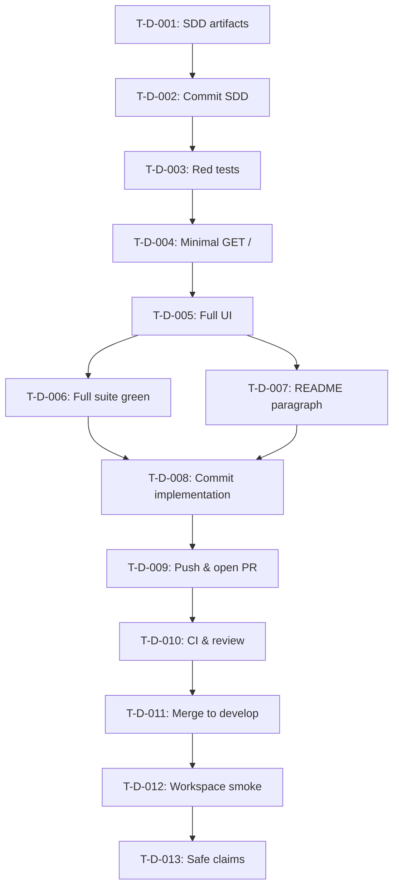

# Dashboard Task List — v0.1

**Version:** 0.1
**Status:** Draft (SDD phase)
**Branch:** `feature/p0-dashboard`
**Owner:** `unified-finance-integration-api`

---

## Task Status Legend

| Symbol | Status |
|---|---|
| ⬜ | Not started |
| 🔄 | In progress |
| ✅ | Complete |
| ❌ | Blocked |

---

## T-D-001: Author SDD artifacts (this stage)

- **Status:** 🔄
- **Priority:** P0
- **Branch:** `feature/p0-dashboard`
- **Dependencies:** None.
- **Description:** Author the three dashboard SDD documents: `dashboard-spec.md`,
  `dashboard-plan.md`, `dashboard-tasks.md` (this file). Documents define
  objective, user story, FRs, NFRs, ACs, out-of-scope items, interface
  contract dependencies, TDD red → green → refactor sequence, Gitflow/CI
  gates, and safe presentation claims.
- **Deliverables:**
  - `specs/v0.1.0/dashboard-spec.md`
  - `specs/v0.1.0/dashboard-plan.md`
  - `specs/v0.1.0/dashboard-tasks.md`
- **Acceptance Criteria:**
  - [ ] All three files exist at the correct paths.
  - [ ] Each document contains the sections specified in `dashboard-plan.md` §1–§12.
  - [ ] No implementation code, test, or HTML is created in this task.
  - [ ] No commit, push, or PR is performed in this task.
- **Traces to:** Workspace INV-005 (SDD), INV-019 (explicit approval).

---

## T-D-002: Commit SDD artifacts

- **Status:** ⬜
- **Priority:** P0
- **Branch:** `feature/p0-dashboard`
- **Dependencies:** T-D-001.
- **Description:** Commit the three SDD artifacts on `feature/p0-dashboard`
  using a Conventional Commit. Do **not** include implementation code, tests,
  or HTML in this commit.
- **Deliverables:**
  - One local commit containing exactly the three SDD artifacts.
- **Acceptance Criteria:**
  - [ ] Commit message follows Conventional Commits (e.g., `docs(api): add P0 dashboard SDD`).
  - [ ] Commit contains exactly three changed files (`git show --stat`).
  - [ ] No test file, no HTML file, no `app/main.py` change is included.
- **Traces to:** Workspace INV-007 (Conventional Commits), INV-019 (explicit approval).

---

## T-D-003: Create red dashboard tests

- **Status:** ⬜
- **Priority:** P0
- **Branch:** `feature/p0-dashboard`
- **Dependencies:** T-D-002.
- **Description:** Create `tests/test_dashboard.py` with tests that assert
  `GET /` returns HTTP 200 with `Content-Type: text/html`, contains all
  required `data-testid` markers, the Russian button label, the
  disclaimer text, and contains no forbidden tokens
  (`simulator:5000`, `/health`, `PROVIDER_API_KEY`, `X-API-Key`,
  `localStorage`, `sessionStorage`, `IndexedDB`).
- **Deliverables:**
  - `tests/test_dashboard.py`
- **Acceptance Criteria:**
  - [ ] File exists and contains the tests enumerated in `dashboard-plan.md` §5.1.
  - [ ] Running `pytest tests/test_dashboard.py -q` against the baseline
        (no `GET /`, no `app/static/index.html`) demonstrates **red**.
- **Traces to:** Workspace INV-011 (TDD), spec AC-D-01..AC-D-10.

---

## T-D-004: Implement minimal `GET /` route

- **Status:** ⬜
- **Priority:** P0
- **Branch:** `feature/p0-dashboard`
- **Dependencies:** T-D-003.
- **Description:** Add an explicit `GET /` route in `app/main.py` returning
  `HTMLResponse` from `app/static/index.html`. Existing `/health` and
  `POST /api/v1/sync/invoices` routes are declared **first** so they keep
  priority. A minimal placeholder `app/static/index.html` containing all
  required `data-testid` markers and Russian labels is created.
- **Deliverables:**
  - Modified `app/main.py`
  - Created `app/static/index.html` (minimal placeholder)
- **Acceptance Criteria:**
  - [ ] `pytest tests/test_dashboard.py -q` is **green**.
  - [ ] Existing `pytest tests/test_sync.py tests/test_health.py -q` remains green.
  - [ ] No new endpoint, no dependency, no `requirements.txt` change.
  - [ ] No `StaticFiles` mount on `/` is introduced.
- **Traces to:** Spec AD-D-01, AD-D-02; plan §3, §5.2.

---

## T-D-005: Implement full dashboard UI

- **Status:** ⬜
- **Priority:** P0
- **Branch:** `feature/p0-dashboard`
- **Dependencies:** T-D-004.
- **Description:** Replace the minimal `app/static/index.html` placeholder with
  the full HTML/CSS/JS implementation: header, summary section, sync
  button, status region with `aria-live="polite"` and `aria-busy`,
  responsive invoice table, disclaimer, four states (initial / loading /
  success / error), and status translation table.
- **Deliverables:**
  - Modified `app/static/index.html` (full implementation)
- **Acceptance Criteria:**
  - [ ] All spec AC-D-01..AC-D-13 are met.
  - [ ] No fixed invoice count assertion is hard-coded.
  - [ ] No simulator URL, no `/health`, no API key, no storage API is referenced in the HTML/JS.
  - [ ] Color is not the only state carrier for any visual state.
- **Traces to:** Spec §3–§7; plan §4.

---

## T-D-006: Full API test suite green

- **Status:** ⬜
- **Priority:** P0
- **Branch:** `feature/p0-dashboard`
- **Dependencies:** T-D-005.
- **Description:** Run the full API test suite to confirm no regression in
  existing behavior.
- **Deliverables:**
  - One local run of `.venv/Scripts/python.exe -m pytest -q`
- **Acceptance Criteria:**
  - [ ] `pytest -q` reports zero failures across `test_dashboard.py`, `test_sync.py`, `test_health.py`.
- **Traces to:** Spec AC-D-13.

---

## T-D-007: Update README

- **Status:** ⬜
- **Priority:** P0
- **Branch:** `feature/p0-dashboard`
- **Dependencies:** T-D-005.
- **Description:** Add one paragraph to `README.md` documenting that the
  dashboard is served at `http://localhost:8000/` when the API is running.
- **Deliverables:**
  - Modified `README.md` (one paragraph addition)
- **Acceptance Criteria:**
  - [ ] README contains a one-sentence description that the dashboard is
        available at the API root and that pressing the button calls
        `POST /api/v1/sync/invoices`.
  - [ ] No false claim that the dashboard has been run or merged is added.
- **Traces to:** Spec §10 (no misclaim).

---

## T-D-008: Commit implementation

- **Status:** ⬜
- **Priority:** P0
- **Branch:** `feature/p0-dashboard`
- **Dependencies:** T-D-002, T-D-006, T-D-007.
- **Description:** Commit the implementation (route + HTML + tests + README)
  using a Conventional Commit.
- **Deliverables:**
  - One local commit with message `feat(api): add static P0 dashboard at /`
- **Acceptance Criteria:**
  - [ ] Commit message follows Conventional Commits.
  - [ ] Commit contains exactly the four files in scope (`app/main.py`,
        `app/static/index.html`, `tests/test_dashboard.py`, `README.md`).
  - [ ] No other file is touched.
- **Traces to:** Workspace INV-007, INV-020.

---

## T-D-009: Push and open PR

- **Status:** ⬜
- **Priority:** P0
- **Branch:** `feature/p0-dashboard`
- **Dependencies:** T-D-008.
- **Description:** Push the branch and open a PR against `develop`.
- **Deliverables:**
  - Push to remote.
  - PR open against `develop`.
- **Acceptance Criteria:**
  - [ ] PR exists and targets `develop`.
  - [ ] PR body summarizes the SDD artifacts, the implementation, and the
        TDD evidence (red → green sequence recorded in commit messages or
        PR description).
- **Traces to:** Workspace INV-006 (Gitflow), INV-014 (CI gate), INV-019 (explicit approval).

---

## T-D-010: CI gate and review

- **Status:** ⬜
- **Priority:** P0
- **Branch:** `feature/p0-dashboard` (PR open)
- **Dependencies:** T-D-009.
- **Description:** Wait for API repo CI to pass. CI covers API lint,
  pytest, and Docker build only. CI does **not** perform manual browser
  review. A human reviewer separately confirms, against a running API, the
  initial, loading, and successful sync states and the basic
  keyboard / accessibility experience (focus order, `aria-live`
  announcement).
- **Deliverables:**
  - CI green confirmation on the PR commit.
  - Manual browser review notes in the PR conversation (recorded by the
    human reviewer, **not** by CI).
- **Acceptance Criteria:**
  - [ ] API CI (`lint-and-test`, `docker-smoke-test`) is green on the PR commit.
  - [ ] Reviewer manually confirms initial / loading / successful sync
        states and basic keyboard / accessibility on the running API.
  - [ ] This milestone does **not** require forcing or live-testing a
        provider failure / error state.
- **Traces to:** Workspace INV-014, spec AC-D-01..AC-D-13.

---

## T-D-011: Merge to develop

- **Status:** ⬜
- **Priority:** P0
- **Branch:** `develop`
- **Dependencies:** T-D-010.
- **Description:** Merge `feature/p0-dashboard` to `develop` per Gitflow
  (squash or merge-commit per repository convention).
- **Deliverables:**
  - Merge commit on `develop`.
- **Acceptance Criteria:**
  - [ ] `develop` HEAD contains the dashboard implementation.
  - [ ] No remote branch is force-deleted without separate approval.
- **Traces to:** Workspace INV-006.

---

## T-D-012: Integration regression via workspace smoke runner

- **Status:** ⬜
- **Priority:** P0
- **Dependencies:** T-D-011.
- **Description:** Run `python scripts/smoke_test.py` from
  `integration-workspace` as a regression check after the dashboard is
  merged to `develop`. The existing workspace runner validates API and
  simulator health and one successful `POST /api/v1/sync/invoices`
  only — it is not modified and its request count is not changed.
- **Deliverables:**
  - One local run of the workspace smoke runner.
- **Acceptance Criteria:**
  - [ ] Smoke runner exits 0.
  - [ ] Dashboard `GET /` route validation is covered by `tests/test_dashboard.py`
        inside the API repository; the workspace smoke runner is **not**
        extended to assert anything about the dashboard route.
- **Traces to:** Plan §5.5; integration regression for API/simulator health and sync.

---

## T-D-013: Safe presentation claims

- **Status:** ⬜
- **Priority:** P0
- **Dependencies:** T-D-012.
- **Description:** The presentation claims listed in `dashboard-spec.md`
  §11 ("safe") become safe to make only after **all** of the following are
  satisfied: dashboard API tests pass; full API test suite (`pytest -q`)
  is green; manual browser happy-path review (initial / loading /
  successful sync, keyboard focus order, `aria-live` announcement) is
  recorded by a human reviewer; and the workspace smoke regression exits
  0. All other claims remain forbidden. A live forced-error scenario is
  **not** required for this dashboard milestone.
- **Deliverables:**
  - Approved presentation script referencing only safe claims.
- **Acceptance Criteria:**
  - [ ] Dashboard API tests pass.
  - [ ] Full API test suite is green.
  - [ ] Manual browser happy-path and accessibility review is recorded.
  - [ ] Workspace smoke regression exits 0.
  - [ ] No claim in the presentation script falls outside the safe set.
- **Traces to:** Spec §11.

---

## Dependency Graph

---

## Summary

| Priority | Tasks | Status |
|---|---|---|
| **P0** | T-D-001 | 🔄 In progress (SDD stage, awaiting commit approval) |
| **P0** | T-D-002 through T-D-013 | ⬜ Not started (require explicit stage-by-stage approval) |
